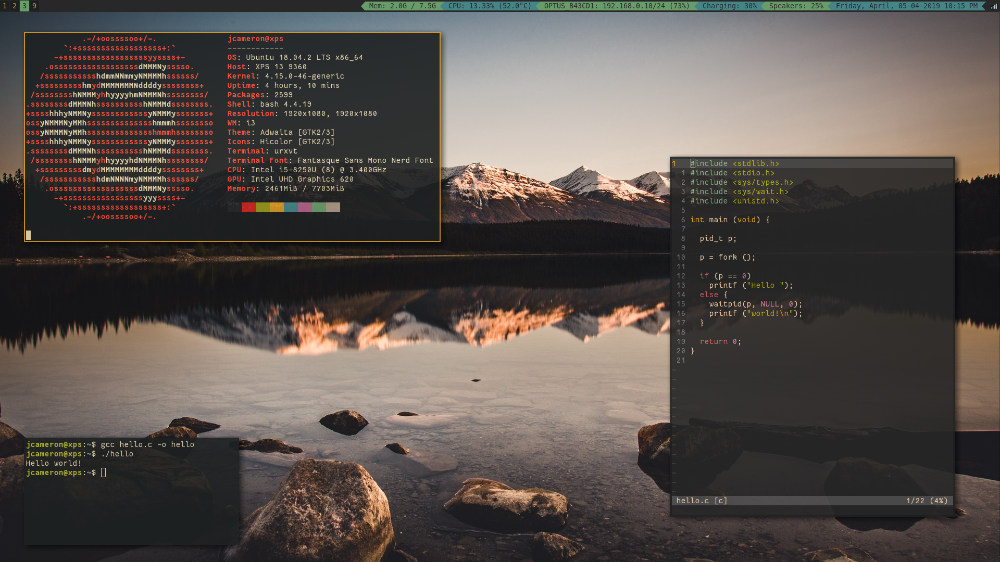

# .dotfiles

These are my .dotfiles (files often used for configuring other programs).
Two scripts are used, `backup.sh` and `restore.sh`, to automate the
backing up process.

Dot files for:
- `.bashrc`
- [`i3`](https://github.com/i3/i3)
- [`i3blocks`](https://github.com/vivien/i3blocks)
- `.scripts` (scripts used for automating various tasks)
- [`.tmux.conf`](https://github.com/tmux/tmux)
- [`.vim`](https://github.com/vim/vim)
- `.Xresources`

Obligatory screenshot:



## Install

Clone the repository and distribute the files using `backup.sh`:
```{sh}
git clone https://github.com/z5210220/.dotfiles ~/.dotfiles
cd ~/.dotfiles
sh backup.sh
```

## `backup.sh` usage

`backup.sh` is used to copy configuration files from the user.
This can be used by running the following commands:
```{sh}
cd ~/.dotfiles
sh backup.sh
```

## `restore.sh` usage

`restore.sh` is used to create symbolic links
from files around the system to the backed up files.
This can be used by running the following commands:
```{sh}
cd ~/.dotfiles
sh restore.sh
```

## Hacking

### Change default directory

Currently `backup.sh` and `restore.sh` accesses all files from
`DOTFILES_SRC` which is defined in both files.
NOTE: moving `.dotfiles` requires `DOTFILES_SRC` to up updated.

### Adding more files to `backup.sh`

To back up more files add the following line to the end of `backup.sh`:
```{sh}
back_up /path/to/file
```

### Adding more files to `restore.sh`

To add another file to restore add the following line to the end of `restore.sh`:
```{sh}
restore name_of_file /path/to/file
```
